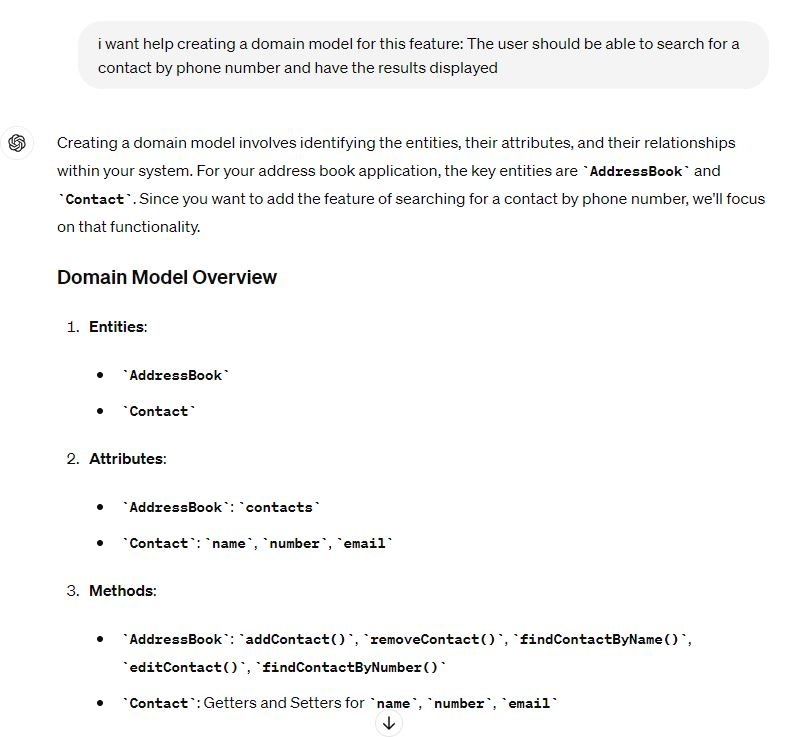
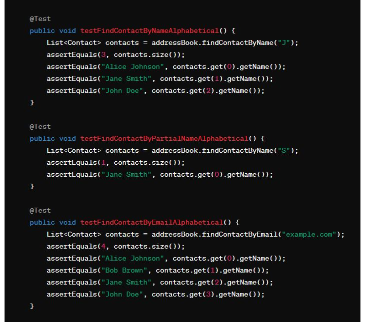
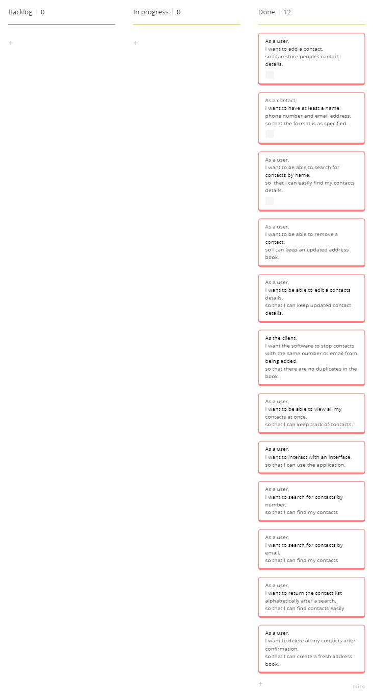

# Domain Models, Class Diagrams and Test Plan

## Core Requirements
## User Story 1
### Domain Model
| Object      | Properties                       | Messages                | Output  |
|-------------|----------------------------------|-------------------------|---------|
| AddressBook | - contacts @ArrayList<@Contacts> | - addContacts(@Contact) | - @Void |
| Contacts    | - name @String                   |                         |         |    

### Test Plan
- **Test 1.1**: Add a contact check array size increases by 1
- **Test 1.2**: Add a contact check it is stored in the array
- **Test 1.3**: Add a null contact check array size stays the same

## User Story 2

### Domain Model
| Object      | Properties       | Messages                             | Output     |
|-------------|------------------|--------------------------------------|------------|
| AddressBook |                  |                                      |            |
| Contacts    | - name @String   | - getName()                          | - @String  |   
|             | - number @String | - getNumber()                        | - @String  |   
|             | - email @String  | - getEmail()                         | - @String  |
|             |                  | - Contact(@String, @String, @String) | - @Void    |
| Validator   |                  | - validateString(@String)            | - @Boolean |
|             |                  | - validateNumber(@String)            | - @Boolean |
|             |                  | - validateString(@String)            | - @Boolean |

### Test Plan
- **Test 2.1**: Test constructor values are set correctly when valid
- **Test 2.2**: Test constructor throws exception when email is empty
- **Test 2.3**: Test constructor throws exception when name is null
- **Test 2.4**: Test constructor throws exception when number is null
- **Test 2.5**: Test constructor throws exception when number is in the wrong format
- **Test 2.6**: Test constructor throws exception when email is in the wrong format

## User Story 3

### Domain Model

| Object      | Properties                       | Messages                       | Output                 |
|-------------|----------------------------------|--------------------------------|------------------------|
| AddressBook | - contacts @ArrayList<@Contacts> | - findContactsByName(@Contact) | - @ArrayList<@Contact> |
| Contacts    | - name @String                   | - getName()                    | - @String              |   
|             | - number @String                 |                                |                        |   
|             | - email @String                  |                                |                        |

### Test Plan

- **Test 3.1.1**: Search for a contact by name return an array containing the contacts
- **Test 3.1.2**: Search for a multiple contact with the same name check array has the correct size
- **Test 3.1.3**: Test empty array is returned when you search through empty contact list 
- **Test 3.1.4**: Search with null check return array has size 0
- **Test 3.1.5**: Find all contacts with a partial name check array size is correct
- **Test 3.1.6**: Find all contacts with a partial name check the correct contacts found

## User Story 4

### Domain Model
| Object      | Properties                       | Messages                   | Output  |
|-------------|----------------------------------|----------------------------|---------|
| AddressBook | - contacts @ArrayList<@Contacts> | - removeContacts(@Contact) | - @Void |
|             |                                  |                            |         |
| Contacts    | - name @String                   |                            |         |   
|             | - number @String                 |                            |         |   
|             | - email @String                  |                            |         |

### Test Plan
- **Test 1.1**: Check array size decreases when valid contact removed
- **Test 4.2**: Check contact is removed from array
- **Test 4.3**: Try and remove a contact not in the book array size should stay the same

## User Story 5

### Domain Model
| Object      | Properties                       | Messages                                            | Output    |
|-------------|----------------------------------|-----------------------------------------------------|-----------|
| AddressBook | - contacts @ArrayList<@Contacts> | - editContacts(@String, @String, @String, @Contact) | - @Void   |
| Contacts    | - name @String                   | - setName(@String)                                  | - @vVoid  |   
|             | - number @String                 | - setNumber(@String)                                | - @vVoid  |   
|             | - email @String                  | - setEmail(@String)                                 | - @vVoid  |

### Test Plan

- **Test 5.1**: Edit a contact number check it is changed
- **Test 5.2**: Edit a contact email check it is changed
- **Test 5.3**: Edit with a null number check exception thrown
- **Test 5.4**: Edit with a empty number check exception thrown

## User Story 6

### Domain Model
| Object      | Properties                       | Messages                      | Output    |
|-------------|----------------------------------|-------------------------------|-----------|
| AddressBook | - contacts @ArrayList<@Contacts> | - addContacts(@Contact)       | - @Void   |
|             |                                  | - checkForDuplicate(@Contact) |           |
| Contacts    | - name @String                   | - getNumber()                 | - @String |   
|             | - number @String                 | - getEmail()                  | - @String |   
|             | - email @String                  |                               |           |

### Test Plan
- **Test 6.1**: Add contact with same number check array size stays the same
- **Test 6.2**: Add contact with email number check array size stays the same

## User Story 7

### Domain Model
| Object      | Properties                       | Messages                                | Output    |
|-------------|----------------------------------|-----------------------------------------|-----------|
| AddressBook | - contacts @ArrayList<@Contacts> |                                         |           |
| Contacts    | - name @String                   | - getName(@String)                      | - @String |   
|             | - number @String                 | - getNumber(@String)                    | - @String |   
|             | - email @String                  | - getEmail(@String)                     | - @String |
| Printer     |                                  | - listAllContacts(@Arraylist <@Contact> | - @Void   |
### Test Plan

## Additional Requirement
## User Story 8

### Domain Model
| Object      | Properties                       | Messages                       | Output                  |
|-------------|----------------------------------|--------------------------------|-------------------------|
| AddressBook | - contacts @ArrayList<@Contacts> | - findContactByNumber(@String) | - @Arraylist <@Contact> |
| Contacts    | - name @String                   | - getNumber(@String)           | - @String               |   
|             | - number @String                 |                                |                         |   
|             | - email @String                  |                                |                         |

### Test Plan
- **Test 3.2.1**: Search for contact with a correct number check that the correct contact is found
- **Test 3.2.2**: Search for contact with incorrect number check empty array returned
- **Test 3.2.3**: Search for contact with null number check empty array returned
- **Test 3.2.4**: Search for contact with partial number check all contacts returned

### Use of AI

## User Story 9

### Domain Model
| Object      | Properties                       | Messages                      | Output                  |
|-------------|----------------------------------|-------------------------------|-------------------------|
| AddressBook | - contacts @ArrayList<@Contacts> | - findContactByEmail(@String) | - @Arraylist <@Contact> |
| Contacts    | - name @String                   | - getEmail(@String)           | - @String               |   
|             | - number @String                 |                               |                         |   
|             | - email @String                  |                               |                         |

### Test Plan

- **Test 3.3.1**: Check correct contact is found when searching with full email 
- **Test 3.3.2**: Check all contacts that have a matching email are returned
- **Test 3.3.3**: Check when searching with an incorrect email that empty array returned
- **Test 3.3.4**: Check when searching with a null email that empty array returned
- **Test 3.3.5**: Check that case sensitivity does not affect the search

### Use of AI

## User Story 10

### Domain Model
| Object      | Properties                       | Messages                                   | Output                  |
|-------------|----------------------------------|--------------------------------------------|-------------------------|
| AddressBook | - contacts @ArrayList<@Contacts> | - sortContactByName(@Arraylist <@Contact>) | - @Void                 |
|             |                                  | - findContactByNumber(@String)             | - @Arraylist <@Contact> |
|             |                                  | - findContactByEmail(@String)              | - @Arraylist <@Contact> |
| Contacts    | - name @String                   | - getNumber(@String)                       | - @String               |   
|             | - number @String                 | - getNumber(@String)                       | - @String               |   
|             | - email @String                  | - getNumber(@String)                       | - @String               |

### Test Plan
- **Test 10.1**: Check Search by name returns list in alphabetical order
- **Test 10.2**: Check Search by number returns list in alphabetical order
- **Test 10.3**: Check Search by email returns list in alphabetical order

### Use of AI

## User Story 11

### Domain Model

| Object      | Properties                       | Messages                      | Output  |
|-------------|----------------------------------|-------------------------------|---------|
| AddressBook | - contacts @ArrayList<@Contacts> | - deleteAllContacts(@Boolean) | - @Void |
| Contacts    | - name @String                   |                               |         |   
|             | - number @String                 |                               |         |   
|             | - email @String                  |                               |         |

### Test Plan
- **Test 11.1**: Test that when confirmed all contacts are removed and contact list is empty 
- **Test 11.2**: Test that when not confirmed contacts are not removed and contact list is same size

### Use of AI

## Kanban Board With User Stories

